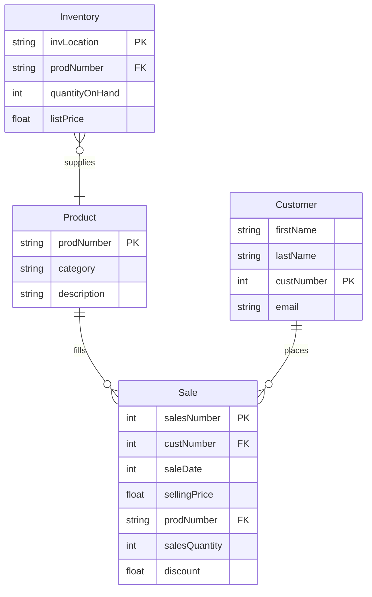

# NikeStore_ERD.md
 ERD of a Nike store

---
title: Nike Store
---

# Product 
Product has a one to many relationship with sales. This is because the product has one prodNumber and can be applied or filled through many sales.

Product includes
* string prodNumber PK - the unique number for each product
* string category - the category of shoe like tenis shoe, running shoe, ect
* string description - color, make, model
# Customer
Customer has a one to many relationship to sales. This is because one customer defined by the custNumber can place many sales.

Customer includes
* string firstName
* string lastName
* int custNumber PK
* string email
# Sales
Sales includes 
* int salesNumber PK - A unique identifier to distinguish between the sales placed
* int custNumber FK - from the customer entry to keep track of what cumtomer placed the sale
* int saleDate - The day that the sale was placed
* float sellingPrice - The price that the items are sold for
* string prodNumber FK - the product number relates to what was placed in the sale
* int salesQuantity - How many of the items were bought
* float discount - if there was a discount it could affrect the selling price
# Inventory
Inventory has a many to one relationship to products. There are many locations for one product

Inventory includes
* string invLocation PK - There can be many locations the products can be found
* string prodNumber FK - Product number defines what you are looking for
* int quantityOnHand - how much of the product is available
* float listPrice - how much the item is projected/marketed to sell for
